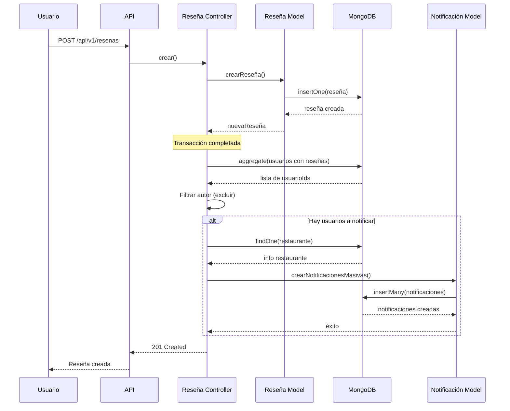

# Sistema de Notificaciones

## 📋 Descripción General

Este documento describe la implementación del sistema de notificaciones para la aplicación FoodStars. El sistema permite notificar automáticamente a los usuarios cuando se publica una nueva reseña en un restaurante que ellos han reseñado previamente.

---

## 📝 Lo que se Pidió (Requisitos)

### Requerimiento Principal

**Cada vez que un restaurante reciba una nueva reseña, se debe crear automáticamente una notificación en la base de datos para todos los usuarios que tengan reseñas de ese restaurante.**

### Endpoints Requeridos

1. **GET `/notificaciones/:usuarioId`**
   - Consultar notificaciones de un usuario específico
   - Debe permitir filtros y paginación

2. **PUT `/notificaciones/:id/vista`**
   - Marcar una notificación como vista
   - Actualizar el estado de visualización

### Características Esperadas

- ✅ Creación automática de notificaciones al crear una reseña
- ✅ Exclusión del autor de la reseña (no se notifica a sí mismo)
- ✅ Sistema de consulta con filtros y paginación
- ✅ Sistema de marcado de notificaciones como vistas
- ✅ Información relacionada (restaurante y reseña) en las notificaciones

---

## ✅ Lo que se Solucionó (Implementación)

### 1. Sistema de Creación Automática de Notificaciones

**Implementado:**
- ✅ Notificaciones se crean automáticamente cuando se publica una nueva reseña
- ✅ Se notifica a todos los usuarios que tienen reseñas previas del restaurante
- ✅ El autor de la reseña NO recibe notificación (exclusión automática)
- ✅ Operación no bloqueante (no afecta la creación de la reseña si falla)

### 2. Endpoints Implementados

#### GET `/api/v1/notificaciones/:usuarioId`

**Funcionalidades:**
- ✅ Consulta notificaciones de un usuario específico
- ✅ Filtro por notificaciones no vistas (`soloNoVistas=true`)
- ✅ Paginación con `limite` y `saltar`
- ✅ Incluye información relacionada (restaurante y reseña)
- ✅ Retorna metadatos de paginación y conteo de no vistas

#### PUT `/api/v1/notificaciones/:id/vista`

**Funcionalidades:**
- ✅ Marca una notificación como vista
- ✅ Actualiza el campo `vista` a `true`
- ✅ Actualiza `fechaActualizacion`
- ✅ Retorna la notificación actualizada

### 3. Arquitectura Implementada

**Estructura de Archivos Creados:**
- ✅ `src/models/notificacion.model.js` - Modelo de datos y operaciones de BD
- ✅ `src/controllers/notificacion.controller.js` - Lógica de negocio
- ✅ `src/routes/notificacion.routes.js` - Definición de rutas y validaciones

**Archivos Modificados:**
- ✅ `src/controllers/reseña.controller.js` - Agregada lógica de creación automática
- ✅ `src/server.js` - Registradas las rutas de notificaciones

### 4. Modelo de Datos

**Colección: `notificaciones`**

```javascript
{
  _id: ObjectId,                    // ID único de la notificación
  usuarioId: ObjectId,              // ID del usuario destinatario
  tipo: String,                     // Tipo de notificación (ej: 'nueva_reseña')
  mensaje: String,                  // Mensaje de la notificación
  vista: Boolean,                   // Estado de visualización (default: false)
  restauranteId: ObjectId,          // ID del restaurante relacionado (opcional)
  reseñaId: ObjectId,               // ID de la reseña relacionada (opcional)
  fechaCreacion: Date,              // Fecha de creación
  fechaActualizacion: Date          // Fecha de última actualización
}
```

---

## 🔧 Cómo se Solucionó (Detalles Técnicos)

### 1. Creación Automática de Notificaciones

#### Problema a Resolver
Crear notificaciones automáticamente cuando se publica una reseña, notificando a usuarios con reseñas previas del mismo restaurante, excluyendo al autor.

#### Solución Implementada

**Ubicación:** `src/controllers/reseña.controller.js` (función `crear`)

**Proceso:**

1. **Después de crear la reseña exitosamente:**
   ```javascript
   // La reseña se crea en una transacción
   await ejecutarTransaccion(async (session) => {
       nuevaReseña = await crearReseña(...);
       // Actualizar promedio del restaurante
   });
   ```

2. **Buscar usuarios con reseñas previas:**
   ```javascript
   // Usa agregación de MongoDB para obtener IDs únicos de usuarios
   const usuariosConReseñas = await db.collection('reseñas')
       .aggregate([
           { $match: { restauranteId: nuevaReseña.restauranteId } },
           { $group: { _id: '$usuarioId' } },
           { $project: { usuarioId: '$_id', _id: 0 } }
       ])
       .toArray();
   ```

3. **Excluir al autor:**
   ```javascript
   const usuarioIds = usuariosConReseñas
       .map(u => u.usuarioId.toString())
       .filter(id => id !== usuarioId); // Excluye al autor
   ```

4. **Crear notificaciones masivas:**
   ```javascript
   if (usuarioIds.length > 0) {
       const restaurante = await db.collection('restaurantes').findOne(...);
       
       await crearNotificacionesMasivas(usuarioIds, {
           tipo: 'nueva_reseña',
           mensaje: `Se ha publicado una nueva reseña en ${restaurante?.nombre || 'un restaurante'}`,
           restauranteId: nuevaReseña.restauranteId.toString(),
           reseñaId: nuevaReseña._id.toString()
       });
   }
   ```

**Características:**
- ✅ Operación no bloqueante (fuera de la transacción principal)
- ✅ Manejo de errores con try-catch (no afecta la creación de reseña)
- ✅ Uso de inserción masiva (`insertMany`) para eficiencia

### 2. Modelo de Notificaciones

#### Funciones Implementadas

**`crearNotificacion(notificacionData, session)`**
- Crea una notificación individual
- Valida ObjectIds
- Soporta transacciones MongoDB

**`crearNotificacionesMasivas(usuarioIds, notificacionData, session)`**
- Crea múltiples notificaciones en una sola operación
- Usa `insertMany()` para eficiencia
- Maneja correctamente `insertedIds` (Map u objeto)

**`obtenerNotificacionesPorUsuario(usuarioId, opciones)`**
- Obtiene notificaciones con filtros y paginación
- Usa agregación con `$lookup` para información relacionada
- Soporta filtro por `soloNoVistas`

**`marcarNotificacionComoVista(notificacionId, session)`**
- Actualiza el campo `vista` a `true`
- Actualiza `fechaActualizacion`
- Retorna la notificación actualizada

**`contarNotificacionesNoVistas(usuarioId)`**
- Cuenta notificaciones no vistas de un usuario
- Útil para badges o contadores

### 3. Controlador de Notificaciones

#### Función: `obtenerNotificaciones`

**Proceso:**

1. **Validación de parámetros:**
   ```javascript
   const { usuarioId } = req.params;
   const { soloNoVistas, limite, saltar } = req.query;
   
   // Validación y valores por defecto
   const opciones = {
       soloNoVistas: soloNoVistas === 'true',
       limite: limite ? parseInt(limite) : 50,
       saltar: saltar ? parseInt(saltar) : 0
   };
   ```

2. **Conteo para paginación:**
   ```javascript
   const totalNotificaciones = await db.collection('notificaciones')
       .countDocuments({
           usuarioId: convertirAObjectId(usuarioId),
           ...(opciones.soloNoVistas && { vista: false })
       });
   ```

3. **Obtener notificaciones con información relacionada:**
   ```javascript
   const notificaciones = await obtenerNotificacionesPorUsuario(usuarioId, opciones);
   const noVistas = await contarNotificacionesNoVistas(usuarioId);
   ```

4. **Retornar respuesta con metadatos:**
   ```javascript
   return responderExito(res, HTTP_STATUS.OK, notificaciones, null, {
       pagination: {
           page: paginaActual,
           limit: opciones.limite,
           total: totalNotificaciones,
           totalPages: totalPages,
           hasMore: paginaActual < totalPages,
           noVistas: noVistas
       }
   });
   ```

#### Función: `marcarComoVista`

**Proceso:**

1. **Validar ID:**
   ```javascript
   const { id } = req.params;
   ```

2. **Marcar como vista:**
   ```javascript
   const notificacionActualizada = await marcarNotificacionComoVista(id);
   ```

3. **Validar resultado y retornar:**
   ```javascript
   if (!notificacionActualizada) {
       return responderError(res, HTTP_STATUS.NOT_FOUND, 'Notificación no encontrada');
   }
   
   return responderExito(res, HTTP_STATUS.OK, notificacionActualizada, 'Notificación marcada como vista');
   ```

### 4. Rutas y Validaciones

#### Rutas Implementadas

**GET `/:usuarioId`**
- Validación de ObjectId con `express-validator`
- Validación de query parameters (`soloNoVistas`, `limite`, `saltar`)
- Middleware de autenticación
- Rate limiting

**PUT `/:id/vista`**
- Validación de ObjectId
- Middleware de autenticación
- Rate limiting

### 5. Agregaciones MongoDB

#### Obtener Usuarios con Reseñas Previas

```javascript
const usuariosConReseñas = await db.collection('reseñas')
    .aggregate([
        { $match: { restauranteId: nuevaReseña.restauranteId } },
        { $group: { _id: '$usuarioId' } },
        { $project: { usuarioId: '$_id', _id: 0 } }
    ])
    .toArray();
```

**Explicación:**
- `$match`: Filtra reseñas del restaurante
- `$group`: Agrupa por `usuarioId` para obtener IDs únicos
- `$project`: Renombra campos para facilitar el acceso

#### Obtener Notificaciones con Información Relacionada

```javascript
const notificaciones = await db.collection(COLLECTION)
    .aggregate([
        { $match: filtro },
        {
            $lookup: {
                from: 'restaurantes',
                localField: 'restauranteId',
                foreignField: '_id',
                as: 'restaurante'
            }
        },
        { $unwind: { path: '$restaurante', preserveNullAndEmptyArrays: true } },
        {
            $lookup: {
                from: 'reseñas',
                localField: 'reseñaId',
                foreignField: '_id',
                as: 'reseña'
            }
        },
        { $unwind: { path: '$reseña', preserveNullAndEmptyArrays: true } },
        { $sort: { fechaCreacion: -1 } },
        { $skip: saltar },
        { $limit: limite }
    ])
    .toArray();
```

**Explicación:**
- `$match`: Filtra notificaciones del usuario
- `$lookup`: Hace JOIN con restaurantes y reseñas
- `$unwind`: Convierte arrays en objetos
- `$sort`: Ordena por fecha (más recientes primero)
- `$skip` y `$limit`: Paginación

### 6. Correcciones Realizadas

#### Problema 1: Acceso a `insertedIds`
**Problema:** `insertedIds` puede ser un Map u objeto según la versión de MongoDB driver.

**Solución:**
```javascript
const insertedId = resultado.insertedIds instanceof Map 
    ? resultado.insertedIds.get(index)
    : resultado.insertedIds[index];
```

#### Problema 2: Uso incorrecto de `restauranteId`
**Problema:** Se usaba `restauranteId` del body en lugar del ObjectId de la reseña creada.

**Solución:**
```javascript
restauranteId: nuevaReseña.restauranteId.toString()
```

#### Problema 3: Manejo de parámetros opcionales
**Problema:** `parseInt(undefined)` retorna `NaN`.

**Solución:**
```javascript
limite: limite ? parseInt(limite) : 50,
saltar: saltar ? parseInt(saltar) : 0

// Validación adicional
if (isNaN(opciones.limite) || opciones.limite < 1) {
    opciones.limite = 50;
}
```

---

## 📖 Documentación de Endpoints

### GET `/api/v1/notificaciones/:usuarioId`

Consulta las notificaciones de un usuario específico.

**Parámetros:**
- `usuarioId` (URL): ID del usuario (ObjectId válido)

**Query Parameters (opcionales):**
- `soloNoVistas` (boolean): Si es `true`, solo retorna notificaciones no vistas
- `limite` (number): Número máximo de resultados (1-100, default: 50)
- `saltar` (number): Número de resultados a omitir para paginación (default: 0)

**Respuesta exitosa (200):**
```json
{
  "success": true,
  "data": [
    {
      "_id": "507f1f77bcf86cd799439011",
      "usuarioId": "507f1f77bcf86cd799439012",
      "tipo": "nueva_reseña",
      "mensaje": "Se ha publicado una nueva reseña en Restaurante XYZ",
      "vista": false,
      "restauranteId": "507f1f77bcf86cd799439013",
      "reseñaId": "507f1f77bcf86cd799439014",
      "fechaCreacion": "2024-01-15T10:30:00.000Z",
      "fechaActualizacion": "2024-01-15T10:30:00.000Z",
      "restaurante": {
        "_id": "507f1f77bcf86cd799439013",
        "nombre": "Restaurante XYZ"
      },
      "reseña": {
        "_id": "507f1f77bcf86cd799439014",
        "comentario": "Excelente comida",
        "calificacion": 5
      }
    }
  ],
  "pagination": {
    "page": 1,
    "limit": 50,
    "total": 10,
    "totalPages": 1,
    "hasMore": false,
    "noVistas": 5
  }
}
```

**Autenticación:** Requerida (JWT)

---

### PUT `/api/v1/notificaciones/:id/vista`

Marca una notificación como vista.

**Parámetros:**
- `id` (URL): ID de la notificación (ObjectId válido)

**Respuesta exitosa (200):**
```json
{
  "success": true,
  "message": "Notificación marcada como vista",
  "data": {
    "_id": "507f1f77bcf86cd799439011",
    "usuarioId": "507f1f77bcf86cd799439012",
    "tipo": "nueva_reseña",
    "mensaje": "Se ha publicado una nueva reseña en Restaurante XYZ",
    "vista": true,
    "restauranteId": "507f1f77bcf86cd799439013",
    "reseñaId": "507f1f77bcf86cd799439014",
    "fechaCreacion": "2024-01-15T10:30:00.000Z",
    "fechaActualizacion": "2024-01-15T10:35:00.000Z"
  }
}
```

**Autenticación:** Requerida (JWT)

---

## 🏗️ Arquitectura de la Implementación

### Estructura de Archivos

```
src/
├── models/
│   └── notificacion.model.js          # Modelo de datos y operaciones de BD
├── controllers/
│   ├── notificacion.controller.js     # Lógica de negocio de notificaciones
│   └── reseña.controller.js           # Modificado para crear notificaciones
├── routes/
│   └── notificacion.routes.js         # Definición de rutas y validaciones
└── server.js                          # Registro de rutas
```

### Modelo de Datos

#### Colección: `notificaciones`

```javascript
{
  _id: ObjectId,                    // ID único de la notificación
  usuarioId: ObjectId,              // ID del usuario destinatario
  tipo: String,                     // Tipo de notificación (ej: 'nueva_reseña')
  mensaje: String,                  // Mensaje de la notificación
  vista: Boolean,                   // Estado de visualización (default: false)
  restauranteId: ObjectId,          // ID del restaurante relacionado (opcional)
  reseñaId: ObjectId,               // ID de la reseña relacionada (opcional)
  fechaCreacion: Date,              // Fecha de creación
  fechaActualizacion: Date          // Fecha de última actualización
}
```

**Índices recomendados:**
- `usuarioId` (para búsquedas rápidas por usuario)
- `{ usuarioId: 1, vista: 1 }` (compuesto, para filtrar por usuario y estado)
- `fechaCreacion` (descendente, para ordenar por más recientes)

### Flujo de Creación Automática de Notificaciones



### Componentes Principales

#### 1. Modelo de Notificaciones (`notificacion.model.js`)

**Funciones principales:**

- `crearNotificacion(notificacionData, session)`: Crea una notificación individual
- `crearNotificacionesMasivas(usuarioIds, notificacionData, session)`: Crea múltiples notificaciones de forma eficiente
- `obtenerNotificacionesPorUsuario(usuarioId, opciones)`: Obtiene notificaciones con información relacionada (restaurante, reseña)
- `marcarNotificacionComoVista(notificacionId, session)`: Marca una notificación como vista
- `contarNotificacionesNoVistas(usuarioId)`: Cuenta notificaciones no vistas de un usuario

**Características:**
- ✅ Soporte para transacciones MongoDB
- ✅ Validación de ObjectIds
- ✅ Agregaciones con JOINs para información relacionada
- ✅ Paginación integrada

#### 2. Controlador de Notificaciones (`notificacion.controller.js`)

**Funciones:**

- `obtenerNotificaciones(req, res)`: Maneja la obtención de notificaciones
  - Valida parámetros
  - Aplica filtros y paginación
  - Incluye conteo de no vistas
  - Retorna información de paginación

- `marcarComoVista(req, res)`: Maneja el marcado de notificación como vista
  - Valida ID de notificación
  - Actualiza estado
  - Retorna notificación actualizada

**Características:**
- ✅ Manejo de errores robusto
- ✅ Validación de entrada
- ✅ Respuestas estandarizadas

#### 3. Rutas de Notificaciones (`notificacion.routes.js`)

**Rutas definidas:**

- `GET /:usuarioId`: Obtener notificaciones
- `PUT /:id/vista`: Marcar como vista

**Validaciones:**
- ✅ Validación de ObjectIds con `express-validator`
- ✅ Validación de query parameters
- ✅ Middleware de autenticación
- ✅ Rate limiting

#### 4. Modificación del Controlador de Reseñas

**Cambios realizados:**

1. **Importación del modelo de notificaciones:**
   ```javascript
   import { crearNotificacionesMasivas } from '../models/notificacion.model.js';
   ```

2. **Lógica de creación automática:**
   - Después de crear la reseña exitosamente
   - Busca todos los usuarios que tienen reseñas del restaurante
   - Excluye al autor de la nueva reseña
   - Obtiene información del restaurante
   - Crea notificaciones masivas para todos los usuarios

3. **Manejo de errores:**
   - La creación de notificaciones está envuelta en un try-catch
   - Si falla, no afecta la creación de la reseña
   - Los errores se registran en consola para debugging

## 🔄 Flujo de Datos

### Creación de Notificaciones

1. **Usuario crea una reseña** → `POST /api/v1/resenas`
2. **Sistema crea la reseña** en transacción
3. **Sistema actualiza el ranking** del restaurante
4. **Sistema busca usuarios** con reseñas del restaurante
5. **Sistema crea notificaciones** para cada usuario (excepto el autor)
6. **Sistema retorna respuesta** exitosa

### Consulta de Notificaciones

1. **Usuario solicita notificaciones** → `GET /api/v1/notificaciones/:usuarioId`
2. **Sistema valida** autenticación y parámetros
3. **Sistema consulta** notificaciones con filtros y paginación
4. **Sistema agrega información** relacionada (restaurante, reseña)
5. **Sistema retorna** notificaciones con metadatos

### Marcado como Vista

1. **Usuario marca notificación** → `PUT /api/v1/notificaciones/:id/vista`
2. **Sistema valida** autenticación y ID
3. **Sistema actualiza** el campo `vista` a `true`
4. **Sistema retorna** notificación actualizada

## 🛠️ Detalles Técnicos

### Agregación de MongoDB para Obtener Usuarios

```javascript
const usuariosConReseñas = await db.collection('reseñas')
    .aggregate([
        { $match: { restauranteId: nuevaReseña.restauranteId } },
        { $group: { _id: '$usuarioId' } },
        { $project: { usuarioId: '$_id', _id: 0 } }
    ])
    .toArray();
```

**Explicación:**
- `$match`: Filtra reseñas del restaurante
- `$group`: Agrupa por usuarioId para obtener IDs únicos
- `$project`: Renombra campos para facilitar el acceso

### Agregación para Obtener Notificaciones con Información Relacionada

```javascript
const notificaciones = await db.collection(COLLECTION)
    .aggregate([
        { $match: filtro },
        {
            $lookup: {
                from: 'restaurantes',
                localField: 'restauranteId',
                foreignField: '_id',
                as: 'restaurante'
            }
        },
        { $unwind: { path: '$restaurante', preserveNullAndEmptyArrays: true } },
        {
            $lookup: {
                from: 'reseñas',
                localField: 'reseñaId',
                foreignField: '_id',
                as: 'reseña'
            }
        },
        { $unwind: { path: '$reseña', preserveNullAndEmptyArrays: true } },
        { $sort: { fechaCreacion: -1 } },
        { $skip: saltar },
        { $limit: limite }
    ])
    .toArray();
```

**Explicación:**
- `$match`: Filtra notificaciones del usuario
- `$lookup`: Hace JOIN con restaurantes y reseñas
- `$unwind`: Convierte arrays en objetos    
- `$sort`: Ordena por fecha (más recientes primero)
- `$skip` y `$limit`: Paginación

## 📊 Consideraciones de Rendimiento

### Optimizaciones Implementadas

1. **Inserción Masiva:**
   - Uso de `insertMany()` en lugar de múltiples `insertOne()`
   - Reduce el número de operaciones a la base de datos

2. **Operación No Bloqueante:**
   - La creación de notificaciones no está en la transacción principal
   - No afecta el tiempo de respuesta de la creación de reseñas

3. **Índices Recomendados:**
   - Índice en `usuarioId` para búsquedas rápidas
   - Índice compuesto en `{ usuarioId: 1, vista: 1 }` para filtros comunes
   - Índice en `fechaCreacion` para ordenamiento

4. **Proyección de Campos:**
   - Solo se obtienen los campos necesarios en las consultas
   - Reduce el tamaño de las respuestas

### Escalabilidad

- **Notificaciones Masivas:** Puede manejar cientos de usuarios sin problemas
- **Paginación:** Limita el número de resultados por consulta
- **Filtros:** Permite consultas eficientes con índices

## 🔒 Seguridad

### Validaciones Implementadas

1. **Autenticación:**
   - Todas las rutas requieren JWT válido
   - Middleware `autenticacionMiddleware` aplicado

2. **Validación de Parámetros:**
   - Validación de ObjectIds con `express-validator`
   - Validación de tipos de datos
   - Validación de rangos (límites, saltar)

3. **Rate Limiting:**
   - Aplicado a todas las rutas
   - Previene abuso de la API

## 🧪 Casos de Uso

### Caso 1: Usuario crea reseña

**Escenario:**
- Usuario A crea una reseña en Restaurante X
- Usuarios B, C y D tienen reseñas previas en Restaurante X

**Resultado:**
- Se crean notificaciones para B, C y D
- Usuario A no recibe notificación (es el autor)

### Caso 2: Usuario consulta notificaciones

**Escenario:**
- Usuario tiene 10 notificaciones (5 vistas, 5 no vistas)
- Solicita solo las no vistas

**Resultado:**
- Retorna solo las 5 no vistas
- Incluye información del restaurante y reseña relacionada

### Caso 3: Usuario marca notificación como vista

**Escenario:**
- Usuario marca una notificación como vista

**Resultado:**
- Campo `vista` se actualiza a `true`
- Campo `fechaActualizacion` se actualiza
- Retorna notificación actualizada

## 📝 Notas de Implementación

### Decisiones de Diseño

1. **Separación de Responsabilidades:**
   - Modelo: Operaciones de base de datos
   - Controlador: Lógica de negocio
   - Rutas: Validación y enrutamiento

2. **Manejo de Errores:**
   - Errores de notificaciones no afectan la creación de reseñas
   - Errores se registran en consola para debugging

3. **Transacciones:**
   - Notificaciones no están en la transacción principal
   - Permite mejor rendimiento y no bloquea operaciones críticas

### Mejoras Futuras

1. **Tipos de Notificaciones:**
   - Expandir tipos más allá de `nueva_reseña`
   - Notificaciones de likes, comentarios, etc.

2. **Notificaciones Push:**
   - Integración con servicios push
   - Notificaciones en tiempo real

3. **Preferencias de Usuario:**
   - Permitir a usuarios configurar qué notificaciones recibir
   - Desactivar notificaciones por tipo

4. **Limpieza Automática:**
   - Eliminar notificaciones antiguas automáticamente
   - Archivado de notificaciones vistas

## 🚀 Uso de la API

### Ejemplo: Obtener Notificaciones

```bash
curl -X GET \
  'http://localhost:3000/api/v1/notificaciones/507f1f77bcf86cd799439012?soloNoVistas=true&limite=10&saltar=0' \
  -H 'Authorization: Bearer YOUR_JWT_TOKEN'
```

### Ejemplo: Marcar como Vista

```bash
curl -X PUT \
  'http://localhost:3000/api/v1/notificaciones/507f1f77bcf86cd799439011/vista' \
  -H 'Authorization: Bearer YOUR_JWT_TOKEN'
```

## 📚 Referencias

- [Documentación de MongoDB Aggregation](https://docs.mongodb.com/manual/aggregation/)
- [Express Validator](https://express-validator.github.io/docs/)
- [MongoDB Transactions](https://docs.mongodb.com/manual/core/transactions/)

---

